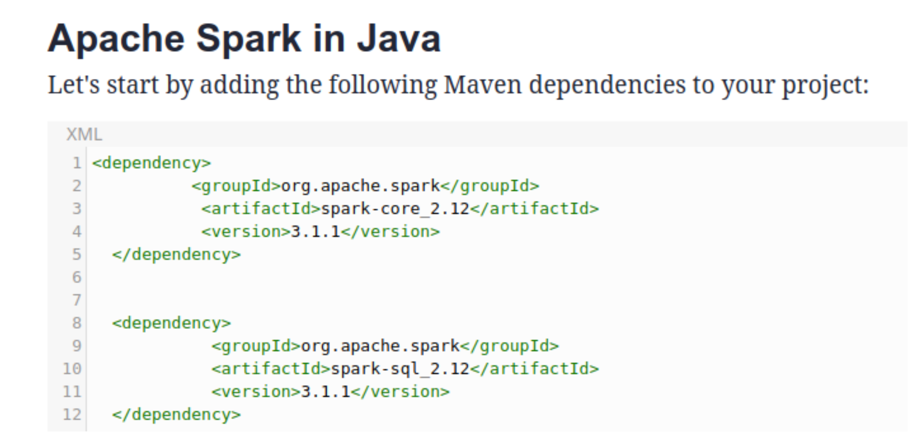

# Modalidad
Busquedas en stack overflow o la internet en general.
Las busquedas se realizan en inglés.

# Preguntas
## ¿Cómo se instala Spark en Arch Linux?
### Instalacion
Busqueda: how to install apache spark on arch linux

> Install the apache-spark (AUR) package.

[Fuente](https://wiki.archlinux.org/title/Apache_Spark)

En mi caso, tengo que correr el siguiente comando:
```
paru -S apache-spark
```

### Comprobar instalacion
Para comprobar que se haya instalado bien añadi algunos imports que encontré
en el ejemplo de este
[link](https://spark.apache.org/docs/0.9.1/java-programming-guide.html)
al proyecto

Como al compilar me saltó un error que me decia que el paquete `org.apache.spark`
no estaba definido, seguí buscando hasta que encontré lo siguiente:



en este [link](https://dzone.com/articles/the-magic-of-apache-spark-in-java-1)

Con lo cual me di cuenta que debia instalar una libreria de java para poder usar
Spark.

### Instalar libreria de java
Busqué `apache-spark` en [Maven](https://mvnrepository.com/artifact/org.apache.spark/spark-core_2.13/3.3.0)
y descargue el archivo .jar de la libreria y lo puse en el directorio lib/

Seguia dandome error al compilar, así que me puse a revisar el makefile que estaba usando
y me di cuenta que no estaba añadiendo la libreria spark al classpath al compilar
el codigo.
Así que la añadi tomando como ejemplo otras partes del makefile
y finalmente no me dio error al compilar el codigo.

## ¿Qué estructura tiene un programa en Spark?
Busqueda: apache spark program structure

Encontré muchas paginas que hablan principalmente sobre la arquitectura de Spark y
sobre como está implementado
pero ninguna que hable sobre como se suele estructurar un programa en spark.

Busqueda 2: apache spark java examples

En base a los ejemplos que encontré observé la siguiente estructura general:

1. Se configura la sesion Spark
2. Se crea un SparkContext
3. Se leen los datos
4. Se procesan los datos con maps y reduces
5. Se imprimen o se guardan los datos resultantes

[Repositorio de ejemplo de Spark con Java](https://github.com/apache/spark/tree/master/examples/src/main/java/org/apache/spark/examples)


## ¿Qué estructura tiene un programa de conteo de palabras en diferentes documentos en Spark?
Busqueda: word count program apache spark java

En base al ejemplo encontrado, interpreto que la estructura es la siguiente:

1. Se configura spark creando un objeto SparkConf
2. Se crear un objeto JavaSparkContext en base al objeto SparkConf
3. Se usa el spark context para cargar los datos
4. Se aplica una serie de maps y reduces al input cargado
5. Se guardan o utilizan los datos modificados

[Fuente](https://www.digitalocean.com/community/tutorials/apache-spark-example-word-count-program-java)

No encontré nada sobre programas de conteo de palabras en diferentes documentos.

## ¿Cómo adaptar el código del Laboratorio 2 a la estructura del programa objetivo en Spark?

Busquedas:
- how to adapto a project to use spark
- how to start using spark on an existing project
- moving to spark on java
- migrate existing project to use spark java

Lo mas cercano a lo que buscaba fue [esto](https://developer.ibm.com/articles/migrating-legacy-applications-to-apache-spark/)
pero aparte de eso no encontré nada que me sirva o que explique como adaptar
un proyecto existente a spark.

Lo que se me ocurre es intentar adaptar la clase principal del proyecto a la
estructura general de un programa spark discutida en otras preguntas del informe.

Quizas usando como regla general el reemplazar bucles 'for' por maps o reduces
siempre que se pueda.

## ¿Cómo se integra una estructura orientada a objetos con la estructura funcional de map-reduce?
Como la pregunta a esta respuesta creo haberla encontrado previamente busqué lo siguiente:

Busqueda: spark with java

Y encontré lo siguiente:

> Java does not support anonymous or first-class functions, so functions
> must be implemented by extending the org.apache.spark.api.java.function.Function, Function2, etc. classes.

En otras palabras, como java no permite las funciones anonimas o de primera clase lo que se hace es
heredar de un objeto de la libreria Spark que representa a una funcion

[Fuente](https://spark.apache.org/docs/0.9.1/java-programming-guide.html)

# Proceso de desarrollo
## Metodologia
Mi idea inicial es intentar adaptar la clase principal del proyecto a la estructura
general de un programa spark de manera iterativa, adaptando cada funcionalidad
de a poco y centrarme en reemplazar bucles 'for' por maps o reduces de ser posible.

Ire explicando los cambios que voy haciendo y de donde voy sacando la informacion
para saber que hacer en los commits que voy creando.

Probablemente me base fuertemente en [esta](https://spark.apache.org/docs/latest/rdd-programming-guide.html#initializing-spark)
pagina de documentacion de Spark.

## Error al compilar
```
************* FeedReader version 1.0 *************
Exception in thread "main" java.lang.NoClassDefFoundError: scala/MatchError
      at FeedReaderMain.main(FeedReaderMain.java:45)
Caused by: java.lang.ClassNotFoundException: scala.MatchError
      at java.base/jdk.internal.loader.BuiltinClassLoader.loadClass(BuiltinClassLoader.java:581)
      at java.base/jdk.internal.loader.ClassLoaders$AppClassLoader.loadClass(ClassLoaders.java:178)
      at java.base/java.lang.ClassLoader.loadClass(ClassLoader.java:522)
      ... 1 more
```
Despues de varias horas de sufrimiento e intentar varias soluciones (reinstalar spark, ver dependencias
, crear contenedor docker, etc) finalmente pude hacer que el programa compile
al empezar a usar la herramienta maven.

Para configurar maven me basé principalmente en este [link](https://maven.apache.org/guides/getting-started/maven-in-five-minutes.html)


