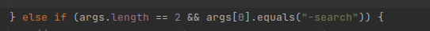
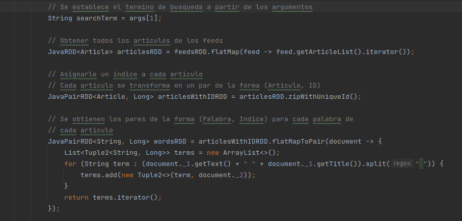
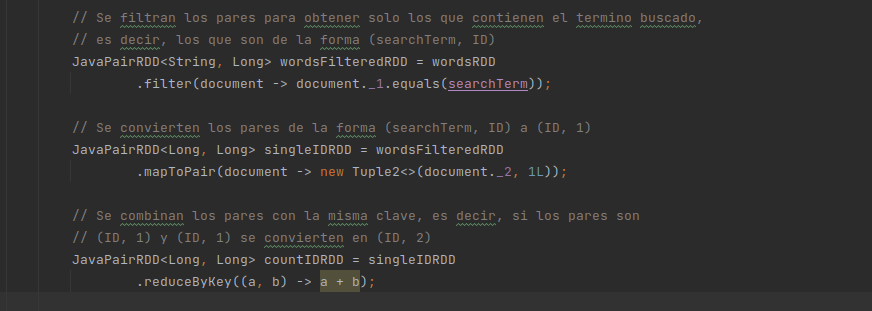

#  Informe
## Modalidad de Trabajo grupal

En esta seccion grupal del proyecto, fuimos comparando nuestras respectivas partes individuales. Y nos dimos cuenta que las tres cumple con lo pedido, al final llegamos a elegir una mas completa y concisa.

Basicamente investigamos sobre lo pedido en el enunciado y a traves de lecturas por la web y preguntas a chat GPT, gracias a esto obtimos una vista gorda, para poder implementar con lo pedido

## Motivos de la eleccion

A la hora de esta eleccion de proyecto, vimos que tanto el proyecto de **Lauti** como el de **Tomi**, realizan un buen funcionamiento, pero el de **Gonza** es uno de los que tiene un rendimiento mejor al resto. No solo eso si no que tambien tenia implementando el punto estrellas.

Entonces fuimos eligiendo lo mejor de cada uno, pero mas que nada nos basamos comletamente en el de **Gonza**.

## Implementación

Lo primero que hacemos en el main es dar otro if, para a la hora de correr el programa elegir la opcion de buscar y ordenar las entidades.
 

Luego siguiendo con la misma parte, establecemos un termino que se quiere buscar en la variable **searchTerm**, creamos un RDD de artículos combinando todos los artículos de los feeds y a cada artículo se le asigna un índice único utilizando **zipWithUniqueId()**, lo que crea un RDD de pares **(Articulo, ID)** y tambien se crea un RDD de pares **(Palabra, Indice)** para cada palabra de cada artículo. Para ello, se divide el texto del artículo en palabras y se asocia cada palabra con su respectivo índice.

Luego filtramos los pares para encontrar el termino buscado, es decir los que son de la forma **(searchTerm, ID)**, se convierten los pares de la forma **(searchTerm, ID)** a **(ID, 1)**, donde el valor 1 representa la aparición del término en un documento y justo despues los que hacemos es combinar os pares con la _misma clave_, es decir, si hay múltiples pares (ID, 1), se suman los valores para obtener el recuento total de apariciones del término en cada documento.

