# Informe: Lab 03

## Forma de trabajo

En la parte individual de este lab, usare la estrategia de ChatGPT.
Utilizare esta estrategia realizando preguntas acerca de las preguntas y las utilizare para responderlas, ademas tambien para ayudarme a utilizar spark y asi realizar el lab.

## Preguntas

> ### ¿Cómo se instala Spark en una computadora personal?

Primero que nada para poder instalarlo en mi nootebook con ubuntu le hice la sig pregunta a chatGPT:

Luego me dio la siguiente respuesta la cual segui paso a paso:

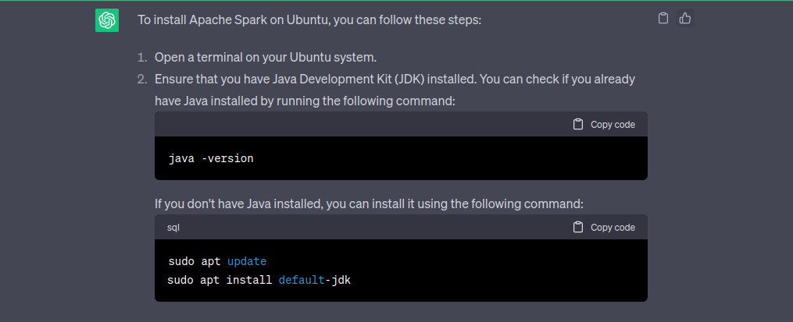

Aca chatgpt me pide que me fije mi version de java.

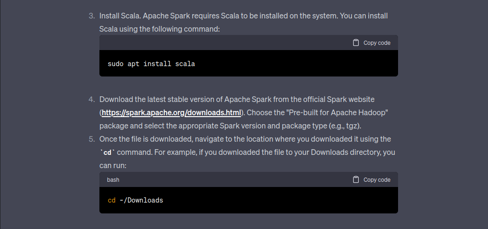

Aca me dice que me descarge en la pagina oficial de spark y descarge la version que quiera y que despues vaya a donde esta el tgz descargado (en descargas).

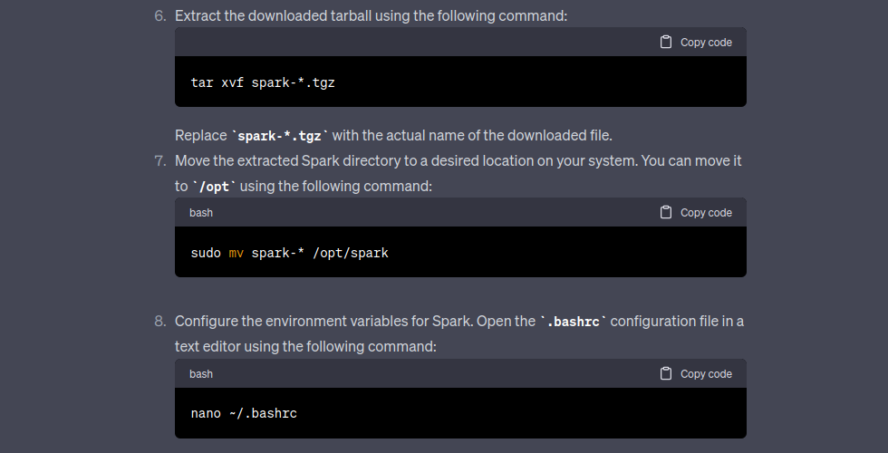

Aca descomprimo tal como me dice que lo haga, en este caso utilizando el nombre adecuado del archivo que tenga y dsp moverlo a la carpeta de opt.
Despues me dice que tengo que configurar las variables de entorno, con el codigo que me da.

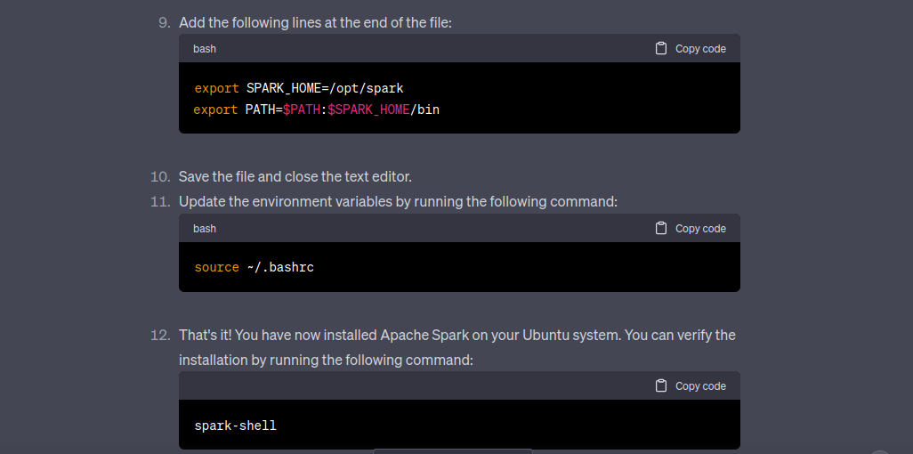

Por ultmo me dice que agrege esas lineas al final del codigo de bashrc, guardarlos y subirlos, y despues verificar que este todo en orden ejecutando ese comando.
Al hacerlo claramente esta todo bien.

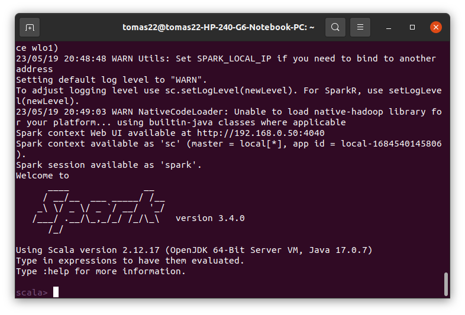

> ### ¿Qué estructura tiene un programa en Spark?

Primero que nada le realizo la pregunta:

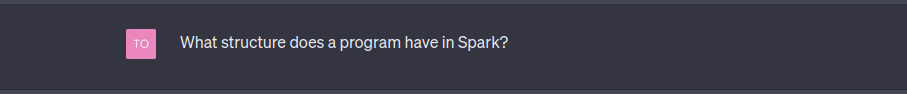

Y me dice lo siguiente, voy a ir comentando el proceso:
Me dice que la estructura en spark tiene las siguientes 6 componentes:

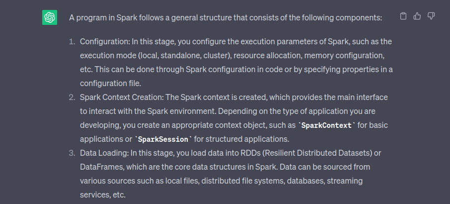

Estos componentes nos hablan de lo siguiente:
 - Configuracion: Se encarga de configurar los parametros de ejecucion de spark, el cual es el punto de entrada a la funcionalidad de spark. Por medio de algun codigo o mediante la especificacion de propiedades en un archivo de configuracion.

 - Creacion del contexto: Crea el contexto de spark, que proporciona la interfaz principal para interactuar con el entorno de Spark. Como dice **SparkContext** para aplicaciones básicas o **SparkSession** para aplicaciones estructuradas.

 - Carga de datos: Carga los datos de entrada en un RDD, DataFrame o DataSet (Estructuras de datos principales de Spark).

Luego nos sigue contando:

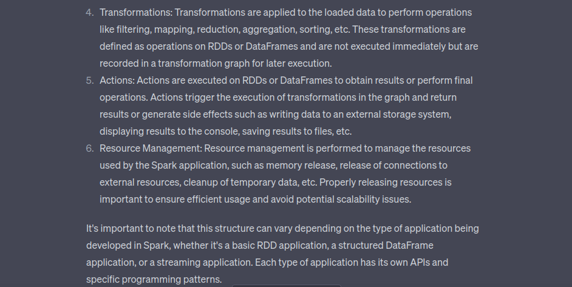

 - Transformaciones: Aplican una función a un RDD, DataFrame o DataSet para crear un nuevo RDD, DataFrame o DataSet. Las transformaciones  no se ejecutan hasta que se llama a una acción.

 - Acciones: Realizan una operación en un RDD, DataFrame o DataSet y devuelven el resultado al controlador de la aplicación o escriben el resultado en un sistema de almacenamiento externo . Las acciones son el punto de entrada para que Spark ejecute el trabajo de la aplicación.

 - Gestion de recursos: Se realiza la gestión de los recursos utilizados por la aplicación de Spark, como la liberación de memoria, la liberación de conexiones a recursos externos, etc. Es importante liberar los recursos utilizados por la aplicación de Spark para que puedan ser utilizados por otras aplicaciones.

> ### ¿Qué estructura tiene un programa de conteo de palabras en diferentes documentos en Spark?

Como siempre le realizo la pregunta:

La respuesta que me da es una cosa parecida a lo del punto anterior, una estructura similar.

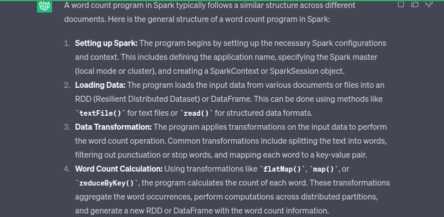

 - Configuración de Spark: El programa comienza configurando las opciones necesarias de Spark.
 - Carga de datos: El programa carga los datos de entrada desde diferentes documentos o archivos en un RDD o DataFrame. Esto se puede hacer utilizando métodos como textFile() para archivos de texto o read() para formatos de datos estructurados.
 - Transformación de datos: El programa aplica transformaciones a los datos de entrada para realizar la operación de conteo de palabras (dividir el texto en palabras, filtrar signos de puntuación o palabras vacías, y asignar a cada palabra un par clave-valor).
 - Cálculo del conteo de palabras: Utilizando transformaciones como flatMap(), map() o reduceByKey(), el programa calcula el conteo de cada palabra. Generan un nuevo RDD o DataFrame con la información del conteo de palabras.

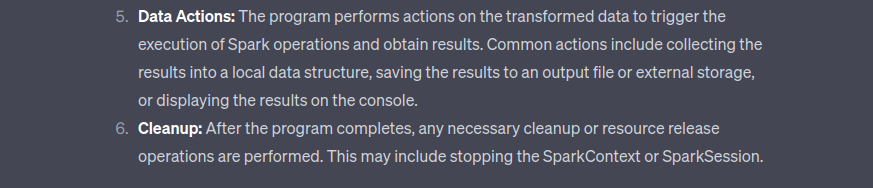
 
 - Acciones sobre los datos: El programa realiza acciones sobre los datos transformados para desencadenar la ejecución de las operaciones de Spark y obtener resultados. 
 - Limpieza: Después de que el programa se completa, se realizan las operaciones de limpieza o liberación de recursos necesarios. Esto puede incluir detener el SparkContext o SparkSession.

> ### ¿Cómo se integra una estructura orientada a objetos con la estructura funcional de map-reduce?

Al preguntarle esta vez decido hacerla en español, veia que me tiraba otra cosa.

Me dice que la estructura orientada a objetos se integra con la estructura funcional de map-reduce de la siguiente manera:

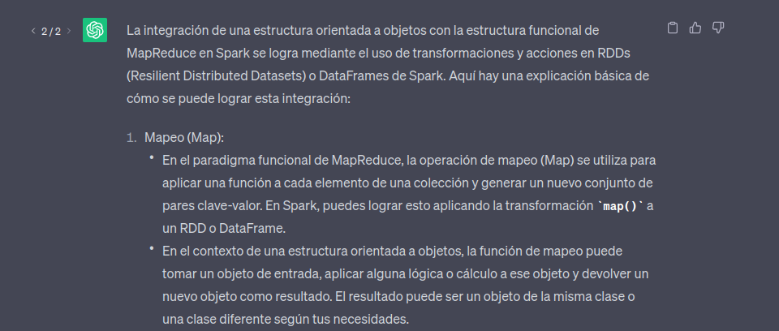

se logra mediante el uso de transformaciones y acciones en RDDs o DataFrames de Spark.

 - Mapeo: Nos dice, resumiendo, que se puede utilizar la transformación map() para aplicar una función a cada elemento de un RDD o DataFrame. La función se aplica de forma independiente a cada elemento del RDD o DataFrame y devuelve un nuevo RDD o DataFrame con los elementos transformados.

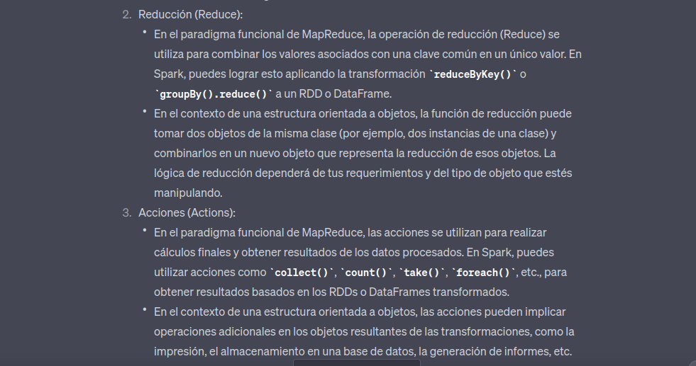

 - Reducción: Resumidamente, En Spark, puedes lograr esto aplicando la transformación reduceByKey() o groupBy().reduce() a un RDD o DataFrame.
 - Accion: En Spark, puedes utilizar acciones como collect(), count(), take(), foreach(), etc., para obtener resultados basados en los RDDs o DataFrames transformados.

En resumen, puedes integrar una estructura orientada a objetos con la estructura funcional de MapReduce en Spark utilizando las transformaciones y acciones proporcionadas por Spark para manipular RDDs o DataFrames. Debes diseñar y aplicar las funciones de mapeo y reducción según tus necesidades específicas y ajustarlas para trabajar con objetos en lugar de solo datos

## IMPLEMENTACION.
