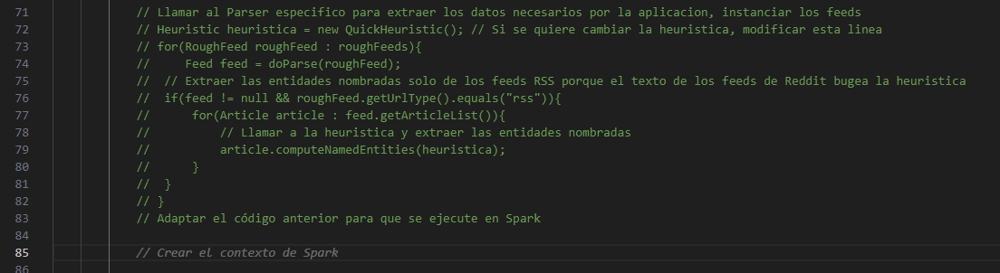

# Informe 

## Modalidad de trabajo parte individual

En la sección individual del proyecto yo estaré utilizando la estrategia de "una inteligencia artificial especificamente orientada a código". En la sección del informe, estarán denotadas...
> de la siguiente manera

...aquellas secciones/textos generados por coPilot y no por mí. Intentaré que la mayor parte del informe/investigación para entender Spark sea generada por coPilot y en casos de necesitar fuentes externas o agregar explicaciones propias, lo haré con formato normal.

## Preguntas básicas de la consigna

Estas preguntas me ayudaron a entender mejor como encarar la parte individual del proyecto.

### ¿Cómo se instala Apache Spark con Java en Windows?
> Para instalar Apache Spark con Java en Windows, primero hay que descargar el archivo .tgz de la página oficial de Apache Spark. Luego, hay que descomprimirlo en la carpeta que se desee. Por último, hay que configurar las variables de entorno para que el sistema operativo pueda encontrar los archivos de Spark.

Realicé todos los pasos anteriores hasta la descompresión del archivo .tgz. Al hacerlo me encontré con una carpeta jars, la cual copie su contenido en la carpeta lib de mi proyecto de Java. Por el momento eso parece funcionar

### ¿Que estructura tiene un programa de Spark?
> Un programa de Spark tiene una estructura de flujo de datos. En este flujo de datos, se pueden distinguir dos tipos de operaciones: las operaciones de transformación y las operaciones de acción. Las operaciones de transformación son aquellas que toman un RDD y devuelven otro RDD. Las operaciones de acción son aquellas que toman un RDD y devuelven un valor.
> 
> Un RDD es una colección de elementos que se distribuyen a través de los nodos del cluster. Los RDDs son inmutables, es decir, que no se pueden modificar. Los RDDs se pueden crear a partir de archivos o de colecciones de datos en memoria.

Literalmente no entendí nada. Voy a probar otras preguntas para ver si puedo entender mejor.

#### ¿Cómo utilizar Spark en Java?
> Para utilizar Spark en Java, hay que crear un SparkContext. El SparkContext es el punto de entrada a Spark. El SparkContext se puede crear a partir de un SparkConf. El SparkConf es una clase que se utiliza para configurar el SparkContext. El SparkContext se puede utilizar para crear RDDs a partir de archivos o de colecciones de datos en memoria. Los RDDs se pueden transformar utilizando operaciones de transformación. Los RDDs se pueden utilizar para realizar operaciones de acción.

Esto me ayudó a entender un poco más la estructura de un programa de Spark. Voy a seguir explorando.

#### ¿Que librerias básicas se utilizan en Spark para Java?
> - org.apache.spark.SparkConf
> - org.apache.spark.SparkContext
> - org.apache.spark.api.java.JavaSparkContext
> - org.apache.spark.api.java.JavaRDD
> - org.apache.spark.api.java.JavaPairRDD
> - org.apache.spark.api.java.JavaDoubleRDD
> - org.apache.spark.api.java.JavaFutureAction
> - org.apache.spark.api.java.JavaSparkStatusTracker
> - org.apache.spark.api.java.JavaStreamingContext
> - org.apache.spark.api.java.JavaDStream

Estoy seguro que varias de esas librerias no las voy a utilizar, pero me sirve para tener una idea de que librerias voy a necesitar. Probablemente importe todas las librerias y luego vaya borrando las que no necesite.

#### ¿Que son las operaciones de transformación y de acción en Spark?
> Las operaciones de transformación son aquellas que toman un RDD y devuelven otro RDD. Las operaciones de acción son aquellas que toman un RDD y devuelven un valor. Por ejemplo la operación map es una operación de transformación que toma un RDD y devuelve otro RDD. Por ejemplo la operación reduce es una operación de acción que toma un RDD y devuelve un valor.

Entiendo un poco más la diferencia entre las operaciones de transformación y de acción. Voy a intentar que coPilot me explique las principales operaciones de transformación y de acción.

#### ¿Cuáles son las principales operaciones de transformación en Spark y cómo se utilizan?
> Las principales operaciones de transformación en Spark son map, flatMap, filter, reduceByKey, groupByKey, sortByKey, join, cogroup, cartesian y sample. 
> - La operación map toma un RDD y devuelve otro RDD. La operación map se utiliza para transformar cada elemento de un RDD en otro elemento.
> - La operación flatMap toma un RDD y devuelve otro RDD. La operación flatMap se utiliza para transformar cada elemento de un RDD en cero o más elementos.
> - La operación filter toma un RDD y devuelve otro RDD. La operación filter se utiliza para filtrar los elementos de un RDD.
> - La operación reduceByKey toma un RDD y devuelve otro RDD. La operación reduceByKey se utiliza para reducir los elementos de un RDD por clave.
> - La operación groupByKey toma un RDD y devuelve otro RDD. La operación groupByKey se utiliza para agrupar los elementos de un RDD por clave.
> - La operación sortByKey toma un RDD y devuelve otro RDD. La operación sortByKey se utiliza para ordenar los elementos de un RDD por clave.
> - La operación join toma dos RDDs y devuelve otro RDD. La operación join se utiliza para unir dos RDDs por clave.
> - La operación cogroup toma dos RDDs y devuelve otro RDD. La operación cogroup se utiliza para agrupar dos RDDs por clave.
> - La operación cartesian toma dos RDDs y devuelve otro RDD. La operación cartesian se utiliza para obtener el producto cartesiano de dos RDDs.
> - La operación sample toma un RDD y devuelve otro RDD. La operación sample se utiliza para obtener una muestra aleatoria de un RDD.

Esto me ayudó a entender mejor las operaciones de transformación. Voy a intentar que coPilot ahora me explique las principales operaciones de acción.

#### ¿Cuáles son las principales operaciones de acción en Spark y cómo se utilizan?
> Las principales operaciones de acción en Spark son collect, count, countByKey, take, takeSample, reduce, fold, aggregate, saveAsTextFile, saveAsSequenceFile, saveAsObjectFile, foreach, foreachPartition, first, top.
> - La operación collect toma un RDD y devuelve una colección. La operación collect se utiliza para obtener todos los elementos de un RDD.
> - La operación count toma un RDD y devuelve un valor. La operación count se utiliza para obtener la cantidad de elementos de un RDD.
> - La operación countByKey toma un RDD y devuelve un valor. La operación countByKey se utiliza para obtener la cantidad de elementos de un RDD por clave.
> - La operación take toma un RDD y devuelve una colección. La operación take se utiliza para obtener los primeros elementos de un RDD.
> - La operación takeSample toma un RDD y devuelve una colección. La operación takeSample se utiliza para obtener una muestra aleatoria de un RDD.
> - La operación reduce toma un RDD y devuelve un valor. La operación reduce se utiliza para reducir los elementos de un RDD.
> - La operación fold toma un RDD y devuelve un valor. La operación fold se utiliza para reducir los elementos de un RDD.
> - La operación aggregate toma un RDD y devuelve un valor. La operación aggregate se utiliza para reducir los elementos de un RDD.
> - La operación saveAsTextFile toma un RDD y devuelve un valor. La operación saveAsTextFile se utiliza para guardar un RDD en un archivo de texto.
> - La operación saveAsSequenceFile toma un RDD y devuelve un valor. La operación saveAsSequenceFile se utiliza para guardar un RDD en un archivo de secuencia.
> - La operación saveAsObjectFile toma un RDD y devuelve un valor. La operación saveAsObjectFile se utiliza para guardar un RDD en un archivo de objetos.
> - La operación foreach toma un RDD y devuelve un valor. La operación foreach se utiliza para aplicar una función a cada elemento de un RDD.
> - La operación foreachPartition toma un RDD y devuelve un valor. La operación foreachPartition se utiliza para aplicar una función a cada partición de un RDD.
> - La operación first toma un RDD y devuelve un valor. La operación first se utiliza para obtener el primer elemento de un RDD.
> - La operación top toma un RDD y devuelve una colección. La operación top se utiliza para obtener los primeros elementos de un RDD.

Son muchisimas operaciones de acción las que me dió copilot, no sé si todas son operaciones de acción o si alguna de estas operaciones es producto de una alucinación de coPilot. Voy a preguntarle un poco sobre los RDD.

#### ¿Qué es un RDD?
> Un RDD es una colección de elementos que se pueden dividir en particiones. Un RDD es inmutable, es decir, no se puede modificar una vez creado. Un RDD es tolerante a fallos, es decir, si una partición falla, se puede recuperar de la partición anterior. Un RDD es distribuido, es decir, se puede distribuir en diferentes nodos. Un RDD es persistente, es decir, se puede almacenar en memoria o en disco. Un RDD es paralelo, es decir, se puede procesar en paralelo.

Según lo que dice coPilot, un RDD es como una lista/conjunto de elementos con ciertas propiedades que ayudan a el procesamiento de los datos de manera distribuida.

### ¿Qué estructura tiene un programa de conteo de palabras en diferentes documentos en Spark?
> Un programa de conteo de palabras en diferentes documentos en Spark tiene la siguiente estructura: 
> 1. Se crea un SparkContext.
> 2. Se crea un RDD a partir de los archivos de texto.
> 3. Se realiza un flatMap para separar las palabras de cada línea.
> 4. Se realiza un map para asignarle a cada palabra un valor de 1.
> 5. Se realiza un reduceByKey para sumar los valores de las palabras.
> 6. Se realiza un collect para obtener el resultado.
> 7. Se cierra el SparkContext.

El primer renglón fue fácil de generar, todo lo demás fue necesario escribir el "1." para que coPilot me sugiera el siguiente paso. 

Me parece que podré aprovechar la estructura anterior para identificar las entidades nombradas y sumar el número de ocurrencias de cada una.

### ¿Cómo se integra una estructura orientada a objetos con la estructura funcional de map-reduce?
> Una estructura orientada a objetos se puede integrar con la estructura funcional de map-reduce utilizando la función map para transformar los objetos en pares clave-valor y la función reduceByKey para reducir los valores de los pares clave-valor.

Tristemente coPilot me dio una respuesta muy general, espero que esto no me presente problemas durante el desarrollo.

## Realización del proyecto

Una vez ya con las ideas claras gracias a las preguntas anteriores, comencé a desarrollar los cambios en el proyecto.

El proceso de desarrollo fue el siguiente:
1. Me senté a analizar el código que ya tenia y como adaptarlo para que funcionara con Spark de manera distribuida. Después de pensar un rato decidi que me apoyaría en la estructura que me sugirió coPilot para un programa de conteo de palabras en diferentes documentos en Spark. La estructura iba a ser la siguiente:
   1. Se crea un SparkContext y un RDD a partir de los textos de los articulos.
   2. Se realiza un flatMap para separar las palabras de cada línea.
   3. Se realiza un map para asignarle a cada palabra un valor de 1.
   4. Se realiza un reduceByKey para sumar los valores de las palabras.
   5. Se realiza un collect para obtener el resultado.
   6. Se cierra el SparkContext.
2. Una vez que tengo la estructura en mi mente, comencé a escribir el código. 
   1. Primero importe las librerias necesarias para trabajar con Spark según coPilot. Las librerias `org.apache.spark.api.java.JavaDStream` y `org.apache.spark.api.java.JavaStreamingContext` me daban error asi que las quite.
   2. Comenté el código anterior para que copilot lo tenga como referencia y escribi un comentario diciendo que debía adaptarse el codigo anterior para ser utilizado con Spark.
   3. Una vez comentado, coPilot comenzó a sugerirme código para crear el contexto. 
      1. 
      2. 
      3. 
   4. Una vez copilot terminó de sugerirme el código para crear el contexto, comenzo a sugerir el código para crear el RDD a partir de los textos de los articulos. Todas las lineas de la próxima imagen fueron generadas por coPilot: 
   5. Seguí aceptando las sugerencias de coPilot hasta que me sugirió el código para realizar el flatMap. Aquí tuvo un poco de problemas, ya que me sugirió utilizar un método de la clase `feed` que devuelve una lista y yo necesito un iterador.  Solo fue cuestión de agregar un `.iterator()` al final de la linea dentro del map para que el error desapareciera.
   6. No avancé mucho más hasta que me di cuenta que el enfoque de nuestro proyecto original no era compatible con el calculo distribuido, ya que las entidades nombradas se calculan por articulo y se guardan en una lista `static` "global" que se va llenando conforme se van procesando los articulos. Asi que decidí cambiar el enfoque del proyecto.
3. Los cambios en la estructura del proyecto fueron muy simples y no necesite de coPilot para hacerlo. Los cambios fueron:
   1. El método `computeNamedEntities` de la clase `Article` ya no procesa todas las entidades nombradas del articulo, las inicializa y las agrega a la lista static, si no que procesa las entidades nombradas del articulo y devuelve todos los strings correspondientes en una lista.
4. Con los cambios anteriores y el uso de coPilot seguí recibiendo sugerencias de código para completar el proyecto.
   1. La primera sugerencia que recibí tuvo un pequeño error donde utilizaba el método `getNamedEntities` (inexistente), el cual tuve que actualizar por `computeNamedEntities` y agregarle la heuristica. Otro error que tenia era que la JavaRDD era de entidades nombradas cuando debia ser de Strings. 
   2. Después de ese pequeño error, coPilot me sugirió un código para hacer mapToPair y reducir por clave. Tuve que agregar la libreria `import scala.Tuple2` para que funcionara el código provisto por coPilot.  
   3. Por último (espero) coPilot me sugirió un map para crear las entidades nombradas a partir de los strings.  Este codigo no tiene en cuenta la función `createEntity` de la clase `CreadorEntidades` que sirve para crear la entidad nombrada dependiendo de su categoria y tema, así que tuve que realizarle pequeñas modificaciones para que me permitiera eso y no creara solo entidades nombradas genéricas.
   4. CoPilot me sugería más cosas, pero yo queria "recoger" el resultado y mostrarlo en pantalla, asi que agregué un `collect` y un `for` para mostrar el resultado en pantalla. CoPilot me ayudó a ahorrarme tiempo escribiendo estas lineas de código pero no me proporcionó nada nuevo.
   5. Por último coPilot me sugirió el código para cerrar el contexto. 
5. Luego de terminar el código, lo probé y funcionó a la perfección. Jajajaja es chiste, hubo varios errores relacionados con Spark y la estructura del código:
   1. El más molesto fue que las clases utilizadas para trabajar con Spark necesitan implementar la interfaz `Serializable`, asi que tuve que agregarla a las clases `Article`, `NamedEntity`, `CreadorEntidades` y `Feed`.
   2. Otro erro complicado de encontrar fue que me daba un resultado en el conteo de entidades nombradas mayor al obtenido en el lab2. El problema era causado porque se estaban calculando las entidades nombradas de articulos de feeds de Reddit, por lo que tuve que modificar el flatMap para que solo procesara los articulos de tipo rss, y para detectar cuales articulos eran de tipo rss tuve que agregar un atributo a la clase `Article` que me indicara el tipo de articulo que era.

## Punto estrella

Integre el uso de Spark en la obtención de los feeds mediante una modificación en la clase httpRequester. 

Entonces las tareas que actualmente el programa puede realizar de manera distribuida son:
1. Una vez parseado el archivo de configuración, obtener los feeds. Esto se realiza mediante las operación `flatMap` de Spark y con `collect` se obtienen los resultados. (Todo lo anterior se realiza en la clase `httpRequester`)
2. Una vez obtenidos los feeds, parsearlos y obtener los articulos. Esto se realiza mediante las operació `map` de Spark.
3. Una vez obtenidos los articulos, obtener las entidades nombradas y realizar el conteo de las mismas. Esto se realiza mediante las operaciones `flatMap`, `mapToPair` y `reduceByKey` de Spark, luego se utiliza `collect` para obtener los resultados finales y poder imprimirlos.
